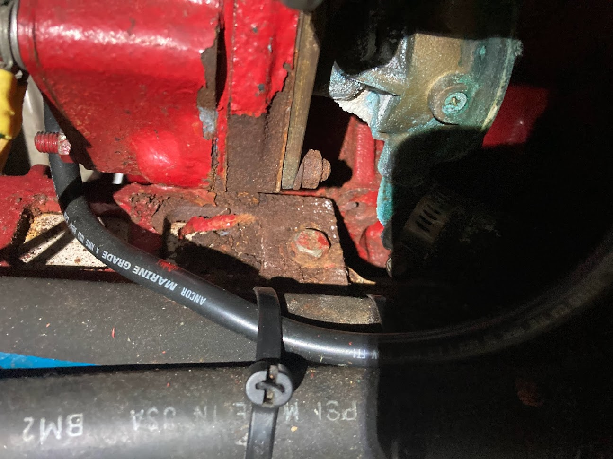
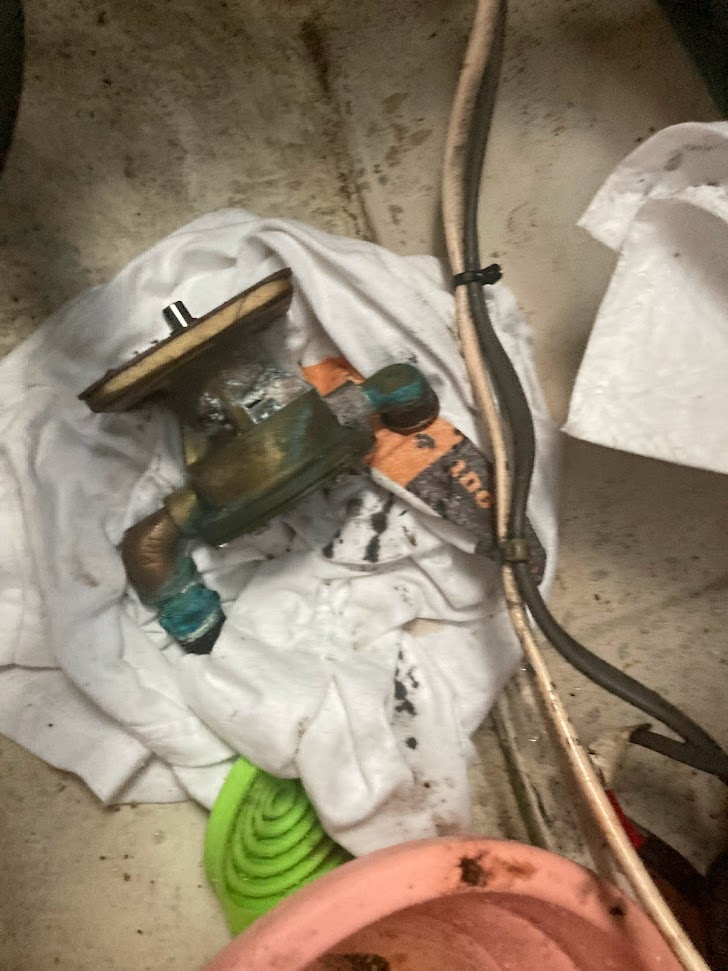
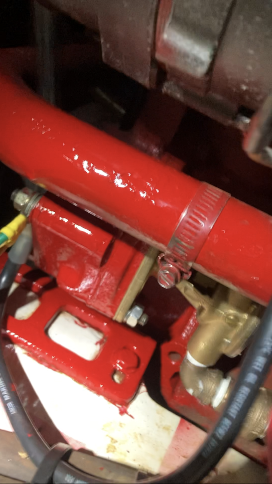
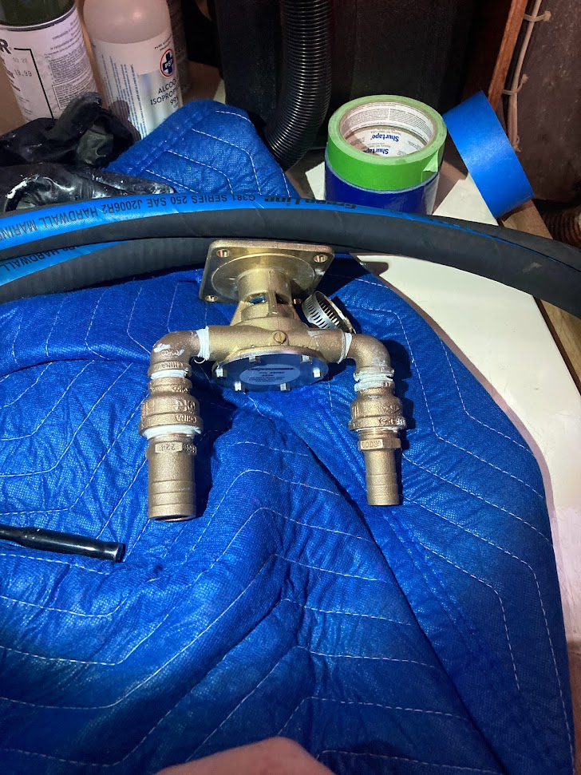

Engine Docs
========================================

Record of engine maintenance
----------------------------
.. list-table:: maintenance
   :widths: 25 25 80
   :header-rows: 1

   * - Date
     - System
     - Details
   * - July 2023
     - Sea water pump
     - | Replaced old Ancor sea pump with W408080. 
       | Docs say ancor pump was serviced in 2016,
       | but quality of work was poor.
   * - July 2023
     - Raw water impeller
     - Impeller was included in the new housing W48080
   * - July 2023
     - Zinc primer and paint to raw water area
     - | Cleaned and painted engine block and raw water housing area
       | that had developed a leak and caused rust.
   * - August 2023
     - Transmission fluid
     - Used Pennzoil Dexron II equivalent ATF fluid
   * - August 2023
     - V-drive oil
     - | Used Delo 400 SAE 30 weight. 
       | Old oil was dark, with some very 
       | fine metal shavings on drain plug.
   * - August 2023
     - Fresh water pump
     - | In July 2023, Gartside noticed leak (not active)
       | from weep hole in the belt-driveb. You can't 
       | water pump. You can't service the pump, so I replaced 
       | with a brand new one. Uses paper gasket and I added
       | loctite 515 to add some extra sealing capability.
       | I also change out the old bypass hose, but it was challenging 
       | since new water pump had larger nipple. I comprimised 
       | and am using a soft-walled tube pressed only the larger nipple.
   * - August 2023
     - Primary (water seperator) fuel filter replaced
     - No notes

Documentation and information about maintenance
-----------------------------------------------

   This is the old pump that the previous owner was charged for.
   As you can see, there is rust everywhere near the pump. I was sad to see
   how much the previous owner was charged. Also, the "new" pump was, at best,
   a serviced housing from an older pump. The greatest sin of the work was
   that proper brass hose barbs were not used to secure the hoses. Instead
   the hoses were directly attached to threads.  

   This is the old pump housing. The photo is blurry, but you can see that no
   hose barbs are attached. Where there is green is where the hoses were attached directly
   to the 90 deg elbow and the threaded section. WTF?

   This is the new pump after paint and proper elbows.

   This is the new pump with proper elbows.